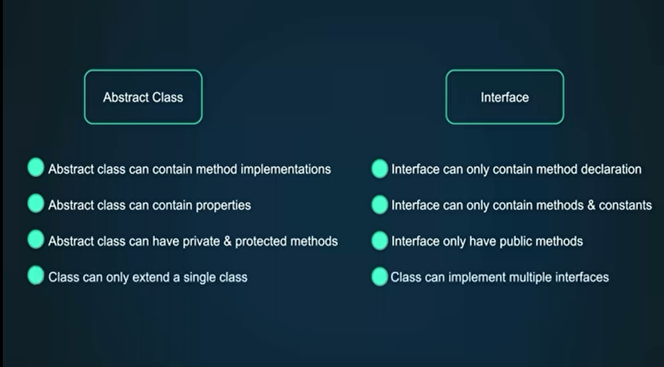

# PHP Gio

# 3- Basic PHP Syntax

- print has a return value of 1.
- You don’t need to close the PHP tag if you’re using code with 100% PHP.
- PHP is a server side language.
- ‘Parse error’ if you forget to use ‘;’.
- The variable can’t start with a number or a special character and can’t include special characters.
- The variables in PHP by default are assigned by value.
- ‘.’ is the concatenation operator in PHP.

```bash
cd htdocs/PHP-Gio/
# php index.php
```

```php
<?php

echo "Hello, world!<br>"; // Hello, world!
print "Hello, world!<br>"; // Hello, world!
echo print "Hello, world!"; // Hello, world!1
echo '<br>';

$name = "Zeina";
echo $name . '<br>'; // Zeina

$x = 1;
$y = &$x;

$x = 2;
echo $y .'<br>'; // 2

$firstName = "Zeina";
echo "Hello, {$firstName}!<br>";
```

```php
<!DOCTYPE html>
<html>
    <body>
        <h1>
            <?= "Hello World!"?>
        </h1>
        <p>My first paragraph</p>
        <?php
            // Comment 1
            # Comment 2
            /*
             * Multi-line comment
             * */
            $x = 2;
            $y = 4;
            echo '<p>' . $x . ', ' . $y . '</p>';
        ?>
    </body>
</html>
```

# 4- What are Constants, Variable Variables

- For the constants once you define them, you can’t change or override the value.
- Magic constants:
  - their value can change depending where they’re used.

```php
<?php

// Constants
define("STATUS_PAID", "paid");
echo defined("STATUS_PAID") . '<br>'; // 1
echo STATUS_PAID . '<br>';

const STATUS = "paid";
echo STATUS . '<br>';

if (true) {
//	const FOO = 'bar'; // This doesn't work
	define('STATUS_PAID', 'paid'); // This works
}

echo PHP_VERSION . '<br />';

$void = "VOID";
define("STATUS_" . $void, 4);
echo STATUS_VOID . '<br>';

// Magic Constants
echo __LINE__ . '<br>';
echo __FILE__ . '<br>';

// Variable Variables
$foo = 'bar';
$$foo = 'baz'; // == ($bar = 'baz')
echo $foo, $bar;
```

---

# 5- Data Types - Typecasting Overview, How it Works

- PHP is dynamically typed or weekly typed language where you aren’t required to define the type of your variable.
- 4 scalar types
  - **bool** - true / false
  - **int** - 1, 2, 3, 0, -4 (no decimal)
  - **float** - 1.5, 0.1, -4.5
  - **string** - “Zeina”
- 4 compound types
  - **array**
  - **object**
  - **callable**
  - **iterable**
- 2 special types
  - **resource**
  - **null**

```php
<?php

declare(strict_types=1);

$completed = true;
$score = 75;
$price = 8.99;
$greeting = "Hello Zeina";

echo $completed . '<br />';
echo $score . '<br />';
echo $price . '<br />';
echo $greeting . '<br />';

echo '<pre>';
var_dump($completed);
echo '</pre>';
echo gettype($completed) . '<br />';

$companies = [1, 2, 3, 4.5, 2.5, "A", "B", true];
echo '<pre>';
print_r($companies);
echo '</pre>';
echo '<br />';

function sum(int $x, int $y) {
    var_dump($x, $y);
    echo '<br />';
    return $x + $y;
}

$sum = sum(2, 4);

echo $sum . '<br />';
var_dump($sum);
echo '<br />';

// Typecasting
$x = (int)'5';
var_dump($x);
echo '<br />';
```

# 6- PHP Boolean Data Type

- false
  - integers 0, -0
  - floats 0.0, -0.0
  - ‘’
  - ‘0’
  - []
  - null

```php
<?php

$isComplete = true;

echo $isComplete . '<br>';

var_dump($isComplete);
echo '<br>';

var_dump(is_bool($isComplete));
echo '<br>';

if ($isComplete) {
    echo "Success";
} else {
    echo "Fail";
}
```

# 7- PHP Integer Data Type

```php
<?php

$x = 4;
echo $x . '<br>';

$y = 0x2A;
echo $y . '<br>';

$z = 055;
echo $z . '<br>';

$m = 0b11;
echo $m . '<br>';

$n = PHP_INT_MAX + 1;
var_dump($n);
echo '<br>';

$i = (int) false;
echo $i . '<br>';
var_dump(is_int($i));
echo '<br>';

$j = 2_000_000_000;
var_dump($j);
```

# 8- PHP Float Data Type

```php
<?php

$x = 13.5e-3;
var_dump($x);;
echo $x . '<br>';

$y = 13_000.5;
var_dump($y);
echo $y . '<br>';

echo PHP_FLOAT_MAX . '<br>';

$z = floor((0.1 + 0.7) * 10);
echo $z . '<br>'; // 7

$m = ceil((0.1 + 0.2) * 10);
echo $m . '<br>'; // 4

$i = 0.23;
$j = 1 - 0.77;
var_dump($i, $j);

if ($i === $j) {
    echo 'yes' . '<br>';
} else {
    echo "no" . '<br>';
}

echo NAN . '<br>';
echo log(-1) . '<br>'; // NAN

echo INF . '<br>';
echo PHP_FLOAT_MAX * 2 . '<br>'; // INF

$n = PHP_FLOAT_MAX * 2;
var_dump(is_infinite($n));
var_dump(is_finite($n));
var_dump(is_nan($n));

$e = '5.5a';
var_dump((float)$e);
```

# 9- PHP String Data Type - Heredoc & Nowdoc Syntax

```php
<?php

$firstName = 'Zeina';
$lastName = 'Zayed';

$name = "${firstName} {$lastName}";

echo $name . '<br>';
echo $name[-2] . '<br>';

$name[1] = 'E';
echo $name . '<br>';

$x = 1;
$y = 2;

// Heredoc
$text = <<<TEXT
Line 1 $x
Line 2 $y
Line 3 ' "
TEXT;
echo nl2br($text) . '<br>';

// Nowdoc
$text = <<<'TEXT'
Line 1 $x
Line 2 $y
Line 3 ' "
TEXT;
echo nl2br($text) . '<br>';
```

# 10- PHP Null Data Type

```php
<?php

// null constant
$x = null;

var_dump($x);
var_dump(is_null($x));
var_dump($x === null);

$y = 123;
unset($y);
var_dump($y); // Warning, NULL

$z = null;
var_dump((string) $z);
```

# 11- PHP Array Data Type - Indexed, Associative & Multi-Dimensional Arrays

- Unlike strings, you can’t access elements from the back of the array using negative numbers.

```php
<?php

$programmingLanguages = ['PHP', 'Java', 'Python'];

echo $programmingLanguages[0] . '<br>';
var_dump(isset($programmingLanguages[3]));
echo '<br>';

$programmingLanguages[1] = 'C++';
echo $programmingLanguages[1] . '<br>';

echo '<pre>';
print_r($programmingLanguages);
echo '</pre>';

echo count($programmingLanguages);

array_push($programmingLanguages, 'Java', 'C#', 'JS');
echo '<pre>';
print_r($programmingLanguages);
echo '</pre>';

echo count($programmingLanguages) . '<br>';

// Assosiative array
$programmingLanguages = [
    'php' => '8.1',
    'python' => '3.9'
];
echo $programmingLanguages['php'] . '<br>';
$programmingLanguages['go'] = '1.15';

echo '<pre>';
print_r($programmingLanguages);
echo '</pre>';

$array = [true => 'foo', 1 => 'bar', '1' => 'baz', 1.8 => 'd', null => 'e'];
print_r($array);
echo $array[''] . '<br>';

$array2 = ['a', 'b', 40 => 'c', 'd', 'e'];
print_r($array2);
// Remove last element
echo array_pop($array2) . '<br>';
print_r($array2);

// Remove first element
echo array_shift($array2);
print_r($array2);

unset($array2[0]);
print_r($array2);
echo '<br>';

$x = 4;

var_dump((array) $x);
echo '<br>';

$array3 = ['a' => 1, 'b' => null];
var_dump(array_key_exists('b', $array3));
var_dump(isset($array3['b']));
```

---

# 12- What Are Expressions In PHP & How They Are Evaluated

```php
<?php

// Expressions
$x = 4;

$y = $x;

$z = $x === $y;
```

# 13- PHP Operators Part 1

- Comparison operators:
  - (==) ⇒ loose comparison.
  - (===) ⇒ strict comparison, also check for data type.

```php
// Arithmetic operators (+ - * / % **)
$x = '10';
$y = 0;

var_dump(+$x); // int(10)
var_dump(-$x); // int(-10)
var_dump(fdiv($x, $y)); // float(INF)

// Assignment operators (= += -= *= /= %= **=)
$x = $y = 4;

$x *= 5;
echo $x;

// String operators (. .=)
$x = 'Hello';

$x .= ' World!';
echo $x;

// Comparison operators (== === !== <> !=== < > <= >= <=> ?? ?:)
$x = 5;
$y = '5';

var_dump($x == $y); // true
var_dump($x <> $y); // false
var_dump($x === $y); // false
var_dump($x <=> $y);
echo '<br>';

$x = 'Hello World';
$y = strpos($x, 'H');

$result = ($y === false) ? 'H not found' : 'H found at index ' . $y;
echo $result . '<br>';

if ($y === false) {
    echo 'H not found' . '<br>';
} else {
    echo 'H found at index ' . $y . '<br>';
}

$x = null;
$y = $x ?? 'hello';
var_dump($y);
```

# 14- PHP Operators Part 2

```php
// Error control operator (@)
$x = @file("foo.txt");

// Increment/Decrement operators (++ --)
$x = 5;

$x++;
$x--;
++$x;
--$x;

echo $x; // 5

$y = 'abc';
echo ++$y; // abd

// Logical operators (&& || ! and or xor)
$x = true;
$y = false;

var_dump($x && $y);

// Bitwise operators (& | ^ ~ << >>)
$x = 6;
$y = 3;

var_dump($x & $y);

// Array operators (+ == === != <> !==)
$x = ['a', 'b', 'c'];
$y = ['d', 'e', 'f', 'g', 'h'];

$z = $x + $y;

var_dump($z);

// Execution operator

// Type operator

// Nullsafe operator
```

# 15- PHP Operators Precedence, Associativity

```php
<?php

$x = 5 + 3 * 5;

echo $x . '<br />'; // 20

$x = (5 + 3) * 5;
echo $x . '<br />'; // 40

$x = 5;
$y = 2;
$z = 10;

$result = $x / $y * $z; // ($x / $y) * $z
echo $result . '<br />';

$x = true;
$y = false;
$z = $x and $y; // ($z = $x) and $y
var_dump($z);
```

---

# 16- Control Structures in PHP - Conditional Statements - if_else

```php
<html>
	<head>
		<title>IF</title>
	</head>
	<body>
	 	<?php $score = 55; ?>
		<?php if ($score >= 90) : ?>
			<strong style="color: green">A</strong>
		<?php elseif ($score >= 80) : ?>
			<strong>B</strong>
		<?php elseif ($score >= 70) : ?>
			<strong>C</strong>
		<?php elseif ($score >= 60) : ?>
			<strong>D</strong>
		<?php else: ?>
			<strong style="color: red">F</strong>
		<?php endif; ?>
	</body>
</html>
```

# 17- PHP Loops Tutorial - Break_Continue Statements

```php
<?php

// while
$i = 0;
while (true) {
    if ($i == 15) {
        break;
    }
    echo $i++ . ' ';
}
echo '<br />';
$i = 0;
while (true) {
	while ($i > 10) {
        break 2;
    }
	echo $i++ . ' ';
}
echo '<br />';
$i = 0;
while ($i <= 15) {
	if ($i % 2 === 0) {
        $i++;
        continue;
    }
	echo $i++ . ' ';
}
echo '<br />';

// do-while
$i = 0;
do {
    echo $i++ . ' ';
} while ($i <= 15);
echo '<br />';

// for
for ($i = 0; $i <= 15; print $i . ' ', $i++) {}
echo '<br />';

// foreach
$programmingLanguages = ['PHP', 'Java', 'Python', 'C++', 'C'];
foreach ($programmingLanguages as $key => $programmingLanguage) {
    echo $key . ': ' . $programmingLanguage . '<br />';
}
echo $programmingLanguage; // C
echo '<br />';

$programmingLanguages = ['PHP', 'Java', 'Python', 'C++', 'C'];
foreach ($programmingLanguages as $key => &$programmingLanguage) {
    $programmingLanguage = 'PHP';
	echo $key . ': ' . $programmingLanguage . '<br />';
}
echo $programmingLanguage; // PHP
echo '<br />';

$user = [
    'name' => 'Zeina',
    'email' => 'zeina@gmail.com',
    'skills' => ['PHP', 'MySQL', 'Laravel']
];

foreach ($user as $key => $value) :
    echo $key . ': ' . json_encode($value) . '<br />';
endforeach;

```

# 18- PHP Switch Statement - Switch vs if-else Statement

- In switch statement the expression only occurs one time.

```php
<?php

$paymentStatuses = [1, 3, 0];
foreach ($paymentStatuses as $paymentStatus) {
	switch ($paymentStatus) {
		case 1:
			echo 'Paid';
			break 2;
		case 2:
		case 3:
			echo 'Payment Declined';
			break;
		case 0:
			echo 'Pending Payment';
			break;
		default:
			echo 'Unknown Payment Status';
	}
	echo '<br />';
}
```

# 19- PHP Match Expression - Match vs Switch

- switch (==)
- match (===)

```php
<?php

$paymentStatus = false;

switch ($paymentStatus) {
	case 1:
		echo 'Paid';
		break;
	case 2:
	case 3:
		echo 'Payment Declined';
		break;
	case 0:
		echo 'Pending Payment';
		break;
	default:
		echo 'Unknown Payment Status';
}
echo '<br />';

$paymentStatusDisplay = match ($paymentStatus) {
	1 > 2 => 'Paid',
	2, 3 => 'Payment Declined',
	0 => 'Pending Payment',
	default => 'Unknown Payment Status',
};
echo $paymentStatusDisplay;
```

---

# 20- PHP Return, Declare \_ Tickable Statements

- return
  ```php
  <?php

  function sum(int $x, int $y)
  {
  	$z = $x + $y;
  	return $z;
  }

  $x = sum(4, 8);

  echo $x . '<br />'; // 12
  echo 'Hello World!'; // Hello World!
  ```
- declare - ticks
  ```php
  <?php

  // declare - ticks
  function onTick()
  {
  	echo 'Tick <br />';
  }

  register_tick_function('onTick');

  declare(ticks = 3);

  $i = 0;
  $length = 10;

  while ($i < $length) {
  	echo $i++ . '<br />';
  }
  ```
- declare - encoding
- declare - strict_types
  ```php
  <?php

  declare(strict_types=1);

  function sum(int $x, int $y)
  {
  	return $x + $y;
  }

  echo sum('4', 8); // Fatal error
  ```

# 21- How To Include Files In PHP - Include and Require

- If the file doesn’t exist:
  - include will result a warning.
  - require will result an error and stop the script execution.
- include:
  ```php
  <?php

  include 'file.php';

  echo 'Hello';
  ```
- require:
  ```php
  <?php

  require 'file.php';

  echo 'Hello';
  ```
- require_once
  - file.php
    ```php
    <?php

    $x = 4;
    ```
  - index.php
    ```php
    <?php

    require_once 'file.php';

    $x++;

    echo $x . '<br />'; // 5

    require_once 'file.php';

    echo $x . '<br />'; // 5

    echo 'Hello';
    ```
- partials/nav.php
  ```php
  <nav>
  	<a href="home.php">Home</a> |
  	<a href="about.php">About</a> |
  	<a href="contact.php">Contact</a> |
  </nav>
  ```
  - index.php
    ```php
    <?php

    ob_start();
    include 'partials/nav.php';
    $nav = ob_get_clean();

    $nav = str_replace('About', 'About Us', $nav);

    echo $nav;
    ```

---

# 22- How To Create Functions In PHP - Functions Tutorial

```php
<?php

function foo()
{
	echo 'Foo <br />';
	function bar()
	{
		echo 'Bar <br/>';
	}
}

foo();
bar();
```

```php
<?php

function foo(): int
{
	return '1';
}

var_dump(foo()); // int(1)
```

```php
<?php

function foo(): void
{
	return;
}

var_dump(foo()); // NULL
```

```php
<?php

function foo(): ?int
{
	return null;
}

var_dump(foo()); // NULL
```

# 23- PHP Function Parameters - Named Arguments - Variadic Functions \_ Unpacking

- Optional parameters must be in the end.
  ```php
  <?php

  declare(strict_types=1);

  function foo(int|float $x,int|float $y)
  {
  	return $x * $y;
  }

  echo foo(5, 10.4);
  ```
  ```php
  <?php

  declare(strict_types=1);

  function foo(int|float &$x,int|float $y) : int|float
  {
  	if ($x % 2 == 0) {
  		$x /= 2;
  	}

  	return $x * $y;
  }

  $a = 6.0;
  $b = 7;

  echo foo($a, $b) . '<br />';

  var_dump($a, $b);
  ```
  ```php
  <?php

  declare(strict_types=1);

  function sum(...$numbers) : int|float
  {
  	return array_sum($numbers);
  }

  $a = 6.0;
  $b = 7;

  $numbers = [10, 20, 30, 40, 50];

  echo sum($a, $b, ...$numbers) . '<br />';

  ```
  ```php
  <?php

  declare(strict_types=1);

  setcookie(name: 'foo', value: 'bar', httponly: true);

  function sum($x, $y) : int|float
  {
  	return $x + $y;
  }

  $a = 6.0;
  $b = 7;

  echo sum(x: $b, y: $a) . '<br />';
  ```

# 24- PHP Variable Scope - Static Variables

- index.php
  ```php
  <?php

  $x = 4;

  function foo()
  {
  	echo $GLOBALS['x'] . '<br />';
  }

  foo();

  echo $x;

  //include('script1.php');
  //
  //echo '<br />';
  //echo $x;
  ```
- script1.php
  ```php
  <?php

  echo $x;

  $x = 8;
  ```
- index.php
  ```php
  <?php

  function getValue()
  {
  	static $value = null;

  	if ($value === null) {
  		$value = someVeryExpensiveFunction();
  	}
  	return $value;
  }

  function someVeryExpensiveFunction()
  {
  	sleep(2);

  	echo 'Processing';

  	return 10;
  }

  echo getValue() . '<br />';
  echo getValue() . '<br />';
  echo getValue() . '<br />';
  ```

# 25- 25- Variable, Anonymous, Callable, Closure \_ Arrow Functions

- Variable function:
  ```php
  <?php

  function sum(...$numbers): int|float
  {
  	return array_sum($numbers);
  }

  $x = 'sum';

  if (is_callable($x)) {
  	echo $x(1, 2, 3, 4);
  } else {
  	echo 'Not callable';
  }
  ```
- Anonymous function:
  ```php
  <?php

  $x = 2;
  $sum = function (...$numbers) use (&$x): int|float
  {
  	$x = 4;
  	echo $x . '<br />';
  	return array_sum($numbers);
  };

  echo $sum(1, 2, 3, 4) . '<br />';

  echo $x;

  ```
- callable type, callback function:
  ```php
  <?php

  $sum = function (callable $callback, int|float ...$numbers): int|float
  {
  	return $callback(array_sum($numbers));
  };

  echo $sum(function ($element) {
  	return $element * 2;
  }, 1, 2, 3, 4);
  ```
- Arrow function:
  ```php
  <?php

  $array = [1, 2, 3, 4];

  $y = 5;
  $array2 = array_map(fn($number)  => $number * $number * ++$y, $array);

  echo '<pre>';
  print_r($array2);
  echo '</pre>';

  echo $y;
  ```

---

# 26- How To Work With Dates & Time Zones

```php
<?php

$currentTime = time();

echo $currentTime . '<br />';

echo $currentTime + 5 * 24 * 60 * 60 . '<br />';

echo $currentTime  - 24 * 60 * 60 . '<br />';

echo date('d/m/Y g:ia') . '<br />';

echo date('d/m/Y g:ia', $currentTime + 5 * 24 * 60 * 60) . '<br />';

echo date_default_timezone_get() . '<br />';

date_default_timezone_set('Africa/Cairo');

echo date_default_timezone_get() . '<br />';

echo date('d/m/Y g:ia') . '<br />';

echo date('d/m/Y g:ia', $currentTime + 5 * 24 * 60 * 60) . '<br />';

echo '<hr />';

echo date('d/m/Y g:ia', mktime(0, 0, 0, 4, 10, null)) . '<br />';

echo date('d/m/Y g:ia', strtotime('2025-02-01 12:13:00')) . '<br />';

echo date('d/m/Y g:ia', strtotime('tomorrow')) . '<br />';

$date = date('d/m/Y g:ia', strtotime('first day of January')) . '<br />';

echo '<pre>';
print_r(date_parse($date));
echo '</pre>';

echo '<pre>';
print_r(date_parse_from_format('d/m/Y g:ia', $date));
echo '</pre>';

```

---

# 27- How To Work With Arrays in PHP

- helpers.php
  ```php
  <?php

  function prettyPrintArray(array $value): void
  {
  	echo '<pre>';
  	print_r($value);
  	echo '</pre>';
  }
  ```
- array_chunk
  ```php
  <?php

  require 'helpers.php';

  $items = ['a' => 1, 'b' => 2, 'c' => 3, 'd' => 4, 'e' => 5];

  prettyPrintArray(array_chunk($items, 2, true));
  ```
- array_combine
  ```php
  <?php

  require 'helpers.php';

  $array1  = ['a', 'b', 'c'];
  $array2 = [5, 10, 15];

  prettyPrintArray(array_combine($array1, $array2));
  ```
- array_filter & array_values
  ```php
  <?php

  require 'helpers.php';

  $array = [1, 2, 3, 4, 5, 6, 7, 8, 9, 10];

  $even = array_filter($array, fn($number) => $number % 2 === 0, ARRAY_FILTER_USE_BOTH);

  $even = array_values($even);

  prettyPrintArray($even);

  ```
- array_keys
  ```php
  <?php

  require 'helpers.php';

  $array = ['a' => 5, 'b' => 10, 'c' => 15, 'd' => 5, 'e' => 10];

  $keys = array_keys($array, 10);

  prettyPrintArray($keys);
  ```
- array_map
  ```php
  <?php

  require 'helpers.php';

  $array1 = ['a' => 1, 'b' => 2, 'c' => 3];
  $array2 = ['d' => 4, 'e' => 5, 'f' => 6];

  $array = array_map(fn($number1, $number2) => $number1 * $number2, $array1, $array2);

  prettyPrintArray($array);
  ```
- array_merge
  ```php
  <?php

  require 'helpers.php';

  $array1 = [1, 2, 3];
  $array2 = ['a' => 4, 'b' => 5, 'c' => 6];
  $array3 = [7, 8, 9, 'b' => 10];

  $merged = array_merge($array1, $array2, $array3);

  prettyPrintArray($merged);
  ```
- array_reduce
  ```php
  <?php

  require 'helpers.php';

  $invoiceItems = [
  	['price' => 9.99, 'qty' => 3, 'desc' => 'Item 1'],
  	['price' => 29.99, 'qty' => 1, 'desc' => 'Item 2'],
  	['price' => 149, 'qty' => 1, 'desc' => 'Item 3'],
  	['price' => 14.99, 'qty' => 2, 'desc' => 'Item 4'],
  	['price' => 4.99, 'qty' => 4, 'desc' => 'Item 5'],
  ];

  $total = array_reduce($invoiceItems,
  	fn($sum, $item) => $sum + $item['qty'] * $item['price'],
  	500
  );

  echo $total;
  ```
- array_search
  ```php
  <?php

  require 'helpers.php';

  $array = ['a', 'b', 'c', 'D', 'E', 'ab', 'bc', 'cd', 'b', 'd'];

  $key = array_search('a', $array);

  if (in_array('a', $array)) {
  	echo 'Letter found!';
  }
  ```
- array_diff
  ```php
  <?php

  require 'helpers.php';

  $array1 = ['a' => 1, 'b' => 2, 'c' => 3, 'd' => 4, 'e' => 5];
  $array2 = ['d' => 4, 'g' => 5, 'i' => 6, 'j' => 7, 'k' => 8];
  $array3 = ['l' => 3, 'm' => 9, 'n' => 10];

  prettyPrintArray(array_diff($array1, $array2, $array3));

  prettyPrintArray(array_diff_assoc($array1, $array2, $array3));

  prettyPrintArray(array_diff_key($array1, $array2, $array3));

  ```
- sort arrays
  ```php
  <?php

  require 'helpers.php';

  $array = ['d' => 3, 'b' => 1, 'c' => 4, 'a' => 2];

  //prettyPrintArray($array);
  //
  //// sort array by values
  //asort($array);
  //
  //prettyPrintArray($array);
  //
  //ksort($array);
  //
  //prettyPrintArray($array);

  usort($array, fn($a, $b) => $a <=> $b);

  prettyPrintArray($array);
  ```
- list
  ```php
  <?php

  require 'helpers.php';

  $array = [1, 2, [3, 4]];

  //list($a, $b, $c, $d) = $array;
  [$a, $b, [$c, $d]] = $array;

  echo $a . ' ' . $b . ' ' . $c . ' ' . $d;
  ```

---

# 28- **How To Work With PHPs Configuration File - PHP.INI**

```php
<?php

// error_reporting, error_log, display_errors
var_dump(ini_get('error_reporting'));
var_dump(E_ALL);

```

---

# 29- PHP Error Handling & Error Handlers

```php
<?php

//trigger_error('Example error', E_USER_ERROR);
//
//echo 1;

function errorHandler(int $type, string $msg, ?string $file = null, ?int $line = null)
{
	echo $type . ': ' . $msg . ' in ' . $file . ' on line ' . $line;

	exit();
}

error_reporting(E_ALL & ~E_WARNING);

set_error_handler('errorHandler', E_ALL);

echo $x;
```

---

# 30- Basic Apache Webserver Configuration & Virtual Hosts

- .htaccess
  ```php
  <IfModule mod_rewirte.c>
      RewriteEngine on

      RewriteCond %{REQUEST_FILENAME} !-d
      RewriteCond %{REQUEST_FILENAME} !-f

      RewriteRule ^ index.php [L]
  </IfModule>
  ```

---

# 31- Working With File System in PHP

```php
<?php

//$dir = scandir(__DIR__);
//
//var_dump(is_file($dir[3]));

//mkdir('foo');
//rmdir('foo');

//mkdir('foo/bar', recursive: true);
//rmdir('foo/bar'); // will delete the bar dir only
//rmdir('foo');

//if (file_exists('foo.txt')) {
//	echo filesize('foo.txt') . '<br />';
//
//	file_put_contents('foo.txt', 'Hello world!');
//
//	clearstatcache();
//	echo filesize('foo.txt') . '<br />';
//} else {
//	echo 'File not found.';
//}

if (!file_exists('foo.txt')) {
	echo 'File not found.';
	return;
}

$file = fopen('foo.txt', 'r');

while (($line = fgets($file)) !== false) {
	echo $line . '<br />';
}

fclose($file);

$file2 = fopen('foobar.txt', 'r');

while (($line = fgetcsv($file2)) !== false) {
	print_r($line);
}
fclose($file2);

echo '<br />';

$content = file_get_contents('foo.txt');
echo $content;

//file_put_contents('bar.txt', 'hello'); // it overrides the content
//file_put_contents('bar.txt', 'world', FILE_APPEND);

// delete file
//unlink('bar.txt');

copy('foo.txt', 'bar.txt');
unlink('bar.txt');

// move the file instead of copying it for (file and directory)
rename('foo.txt', 'bar.txt');

```

---

# 32- Mini Exercise Project Overview

# 33- Building Small Part of The App With Procedural PHP

- app/App.php
  ```php
  <?php

  declare(strict_types=1);

  function getTransactionFiles(string $dirPath): array
  {
  	$files = [];

  	foreach (scandir($dirPath) as $file) {
  		if (is_dir($file)) {
  			continue;
  		}

  		$files[] = $dirPath . $file;
  	}

  	return $files;
  }

  function getTransactions(string $fileName, ?callable $transactionHandler = null): array
  {
  	if (! file_exists($fileName)) {
  		trigger_error('File "' .$fileName . '" does not exist', E_USER_ERROR);
  	}

  	$file = fopen($fileName, 'r');

  	fgetcsv($file);

  	$transactions = [];

  	while (($transaction = fgetcsv($file)) !== false) {
  		if ($transactionHandler !== null) {
  			$transaction = $transactionHandler($transaction);
  		}
  		$transactions[] = $transaction;
  	}

  	return $transactions;
  }

  function extractTransaction(array $transactionRaw): array
  {
  	[$date, $checkNumber, $description, $amount] = $transactionRaw;

  	$amount = (float) str_replace(['$', ','] , '', $amount);

  	return [
  		'date' => $date,
  		'checkNumber' => $checkNumber,
  		'description' => $description,
  		'amount' => $amount
  	];
  }

  function calculateTotals(array $transactions): array
  {
  	$totals = ['netTotal' => 0, 'totalIncome' => 0, 'totalExpense' => 0];

  	foreach ($transactions as $transaction) {
  		$totals['netTotal'] += $transaction['amount'];

  		if ($transaction['amount'] >= 0) {
  			$totals['totalIncome'] += $transaction['amount'];
  		} else {
  			$totals['totalExpense'] += $transaction['amount'];
  		}
  	}

  	return $totals;
  }

  ```
- app/helpers.php
  ```php
  <?php

  declare(strict_types=1);

  function formatDollarAmount(float $amount): string
  {
  	$isNegative = $amount < 0;

  	return ($isNegative ? '-' : '') . '$' . number_format(abs($amount), 2);
  }

  function formatDate(string $date): string
  {
  	return date('M j, Y', strtotime($date));
  }

  ```
- public/index.php
  ```php
  <?php

  declare(strict_types=1);

  $root = dirname(__DIR__) . DIRECTORY_SEPARATOR;

  define('APP_PATH', $root . 'app' . DIRECTORY_SEPARATOR);
  define('FILES_PATH', $root . 'transaction_files' . DIRECTORY_SEPARATOR);
  define('VIEWS_PATH', $root . 'views' . DIRECTORY_SEPARATOR);

  require APP_PATH . 'App.php';
  require APP_PATH . 'helpers.php';

  $files = getTransactionFiles(FILES_PATH);

  $transactions = [];
  foreach ($files as $file) {
  	$transactions = array_merge($transactions, getTransactions($file, 'extractTransaction'));
  }

  $totals = calculateTotals($transactions);

  require VIEWS_PATH . 'transactions.php';

  ```
- transaction_files/sample_1.csv
  ```php
  Date,Check #,Description,Amount
  01/04/2021,7777,Transaction 1,"$150.43"
  01/05/2021,,Transaction 2,"$700.25"
  01/06/2021,,Transaction 3,"-$1,303.97"
  01/07/2021,,Transaction 4,"$46.78"
  01/08/2021,,Transaction 5,"$816.87"
  01/11/2021,1934,Transaction 6,"-$1,002.53"
  01/12/2021,7307,Transaction 7,"$532.22"
  01/13/2021,1352,Transaction 8,"-$704.59"
  01/14/2021,,Transaction 9,"$98.04"
  01/15/2021,,Transaction 10,"-$204.56"
  01/25/2021,,Transaction 11,"$1,056.27"
  01/26/2021,,Transaction 12,"$550.10"
  01/27/2021,,Transaction 13,"-$825.77"
  01/28/2021,4250,Transaction 14,"$212.68"
  01/29/2021,,Transaction 15,"$195.68"
  02/02/2021,9915,Transaction 16,"-$463.75"
  02/03/2021,,Transaction 17,"$78.02"
  02/04/2021,,Transaction 18,"$268.81"
  02/05/2021,,Transaction 19,"$1,360.55"
  02/08/2021,,Transaction 20,"-$594.46"
  02/09/2021,9125,Transaction 21,"$467.39"
  02/10/2021,,Transaction 22,"$39.49"
  02/11/2021,7929,Transaction 23,"-$81.87"
  02/12/2021,,Transaction 24,"$255.64"
  02/12/2021,,Transaction 25,"$13.51"
  ```
- views/transactions.php
  ```php
  <!DOCTYPE html>
  <html lang="en">
  	<head>
  		<title>Transactions</title>
  		<style>
  			table {
  				width: 100%;
  				border-collapse: collapse;
  				text-align: center;
  			}

  			table tr th, table tr td {
  				padding: 5px;
  				border: 1px #eee solid;
  			}

  			tfoot tr th, tfoot tr td {
  				font-size: 20px;
  			}

  			tfoot tr th {
  				text-align: right;
  			}
  		</style>
  	</head>
  	<body>
  		<table>
  			<thead>
  				<tr>
  					<th>Date</th>
  					<th>Check #</th>
  					<th>Description</th>
  					<th>Amount</th>
  				</tr>
  			</thead>
  			<tbody>
                  <?php if (! empty($transactions)): ?>
                      <?php foreach ($transactions as $transaction): ?>
                          <tr>
                              <td><?= formatDate($transaction['date']) ?></td>
                              <td><?= $transaction['checkNumber'] ?></td>
                              <td><?= $transaction['description'] ?></td>
                              <td>
                                  <?php if ($transaction['amount'] < 0): ?>
                                      <span style="color: red">
                                          <?= formatDollarAmount($transaction['amount']) ?>
                                      </span>
                                  <?php elseif ($transaction['amount'] > 0): ?>
                                      <span style="color: green">
                                          <?= formatDollarAmount($transaction['amount']) ?>
                                      </span>
                                  <?php endif; ?>
                              </td>
                          </tr>
                      <?php endforeach; ?>
                  <?php endif; ?>
  			</tbody>
  			<tfoot>
  				<tr>
  					<th colspan="3">Total Income:</th>
  					<td><?= formatDollarAmount($totals['totalIncome'] ?? 0) ?></td>
  				</tr>
  				<tr>
  					<th colspan="3">Total Expense:</th>
  					<td><?= formatDollarAmount($totals['totalExpense'] ?? 0) ?></td>
  				</tr>
  				<tr>
  					<th colspan="3">Net Total:</th>
  					<td><?= formatDollarAmount($totals['netTotal'] ?? 0) ?></td>
  				</tr>
  			</tfoot>
  		</table>
  	</body>
  </html>
  ```

---

# **Section 2 - OOP**

---

# 34- Intro To Object Oriented Programming

- variables ⇒ **properties**.
- functions ⇒ **methods**.
- A **class** is a blueprint.
- An **object** is something you build from that blueprint. (instance of a class)
- **Why OOP?**
  - Better code structure.
  - Easier to maintain.
  - Modular & extendable.
  - Polymorphism flexibility.
  - On demand.
- OOP(paradigm) ≠ MVC(pattern).
- **Principles of OOP:**
  - Encapsulation.
  - Inheritance.
  - Abstraction.
  - Polymorphism.

# 35- PHP Docker Tutorial - Nginx - PHPFM vs Apache

# 36- PHP Classes & Objects - Typed Properties - Constructors & Destructors

- access modifiers:
  - public.
  - private.
  - protected.
- Constructor method is a special function “magic method” that will be called whenever a new instance is created.
- Transaction.php
  ```php
  <?php

  declare(strict_types=1);

  class Transaction
  {
  	private float $amount;
  	private string $description;

  	public function __construct(float $amount, string $description)
  	{
  		$this->amount = $amount;
  		$this->description = $description;
  	}

  	public function addTax(float $rate): Transaction
  	{
  		$this->amount += $this->amount * $rate / 100;
  		return $this;
  	}

  	public function applyDiscount(float $rate): Transaction
  	{
  		$this->amount -= $this->amount * $rate / 100;
  		return $this;
  	}

  	public function getAmount(): float
  	{
  		return $this->amount;
  	}

  	public function __destruct()
  	{
  		echo 'Destruct ' . $this->description . '<br />';
  	}
  }

  ```
- index.php
  ```php
  <?php

  declare(strict_types=1);

  require 'Transaction.php';

  $class = 'Transaction';

  $amount = (new $class(100, 'Transaction 1'))
  			->addTax(8)
  			->applyDiscount(10)
  			->getAmount();

  var_dump($amount);
  echo '<br />';

  $obj = new \stdClass();

  $obj->a = 1;
  $obj->b = 2;

  var_dump($obj);
  echo '<br />';

  $arr = [1, 2, 3];
  $obj1 = (object) $arr;

  var_dump($obj1->{1});
  echo '<br />';

  $obj2 = (object) 1;
  var_dump($obj2);
  echo '<br />';
  var_dump($obj2->scalar);

  ```

# 37- Constructor Property Promotion - Nullsafe Operator

- Transaction.php
  ```php
  <?php

  declare(strict_types=1);

  class Transaction
  {
  	private ?Customer $customer = null;

  	public function __construct(
  		private float $amount,
  		private string $description
  	)
  	{
  	}

  	/**
  	 * @return Customer|null
  	 */
  	public function getCustomer(): ?Customer
  	{
  		return $this->customer;
  	}
  }

  ```
- Customer.php
  ```php
  <?php

  class Customer
  {
  	private ?PaymentProfile $paymentProfile = null;

  	/**
  	 * @return PaymentProfile|null
  	 */
  	public function getPaymentProfile(): ?PaymentProfile
  	{
  		return $this->paymentProfile;
  	}
  }
  ```
- PaymentProfile.php
  ```php
  <?php

  class PaymentProfile
  {
  	public int $id;

  	public function __construct()
  	{
  		$this->id = rand();
  	}
  }
  ```
- index.php
  ```php
  <?php

  declare(strict_types=1);

  require 'PaymentProfile.php';
  require 'Customer.php';
  require 'Transaction.php';

  $transaction = new Transaction(5, 'test');

  //echo $transaction->getCustomer()?->getPaymentProfile()?->id ?? 'foo';

  $profileId = null;

  if ($customer = $transaction->getCustomer()) {
  	if ($paymentProfile = $transaction->getPaymentProfile()) {
  		$profileId  = $paymentProfile->id;
  	}
  }

  echo $profileId;

  ```

# 38- PHP Namespaces Tutorial

- PaymentGateway/Paddel/Transaction.php
  ```php
  <?php

  declare(strict_types=1);

  namespace Paddle;

  class Transaction
  {
  	public function __construct()
  	{
  		var_dump(new CustomerProfile());
  	}
  }
  ```
- PaymentGateway/Paddel/CustomerProfile.php
  ```php
  <?php

  declare(strict_types=1);

  namespace Paddle;

  class CustomerProfile
  {

  }
  ```
- PaymentGateway/Stripe/Transaction.php
  ```php
  <?php

  declare(strict_types=1);

  namespace Stripe;

  class Transaction
  {

  }

  ```
- index.php
  ```php
  <?php

  declare(strict_types=1);

  require_once 'PaymentGateway/Stripe/Transaction.php';
  require_once 'PaymentGateway/Paddle/Transaction.php';
  require_once 'PaymentGateway/Paddle/CustomerProfile.php';

  use Paddle\{Transaction, CustomerProfile};
  use Stripe\Transaction as StripeTransaction;

  $paddleTransaction = new Transaction();
  $stripeTransaction = new StripeTransaction();
  $paddleCustomerProfile = new CustomerProfile();

  var_dump($paddleCustomerProfile, $paddleTransaction, $stripeTransaction);

  ```

# 39- PHP Coding Standards, Autoloading (PSR-4) & Composer

[https://github.com/ZeinaZayed4/PHP-Gio/tree/master/EP39](https://github.com/ZeinaZayed4/PHP-Gio/tree/master/EP39)

# 40- Object Oriented PHP - Class Constants

[https://github.com/ZeinaZayed4/PHP-Gio/tree/master/EP40](https://github.com/ZeinaZayed4/PHP-Gio/tree/master/EP40)

# 41- Static Properties & Methods in Object Oriented PHP

[https://github.com/ZeinaZayed4/PHP-Gio/tree/master/EP41](https://github.com/ZeinaZayed4/PHP-Gio/tree/master/EP41)

# 42- PHP - Encapsulation & Abstraction

- app\PaymentGateway\Paddle\Transaction.php
  ```php
  <?php

  declare(strict_types=1);

  namespace App\PaymentGateway\Paddle;

  class Transaction
  {
  	private float $amount;

  	public function __construct(float $amount)
  	{
  		$this->amount = $amount;
  	}

  	public function copyFrom(Transaction $transaction)
  	{
  		var_dump($transaction->amount, $transaction->sendEmail());
  	}

  	public function process(): void
  	{
  		echo 'Processing $' . $this->amount . ' transaction.';

  		$this->generateReceipt();

  //		$this->sendEmail();
  	}

  	private function generateReceipt()
  	{
  	}

  	private function sendEmail(): bool
  	{
  		return true;
  	}
  }
  ```
- index.php
  ```php
  <?php

  use App\PaymentGateway\Paddle\Transaction;

  require_once __DIR__ . '/vendor/autoload.php';

  $transaction = new Transaction(25);

  $transaction->copyFrom(new Transaction(100));

  echo '<br />';

  $transaction->process();

  ```

# 43- PHP - Inheritance Explained

- Toaster.php
  ```php
  <?php

  namespace App;

  // final class Toaster {}
  class Toaster
  {
  	protected array $slices;
  	protected int $size;

  	public function __construct()
  	{
  		$this->slices = [];
  		$this->size = 2;
  	}

  	public function addSlice(string $slice): void
  	{
  		if (count($this->slices) < $this->size) {
  			$this->slices[] = $slice;
  		}
  	}

  	public function toast(): void
  	{
  		foreach ($this->slices as $i => $slice) {
  			echo ($i + 1) . ': Toasting ' . $slice . PHP_EOL;
  		}
  	}
  }
  ```
- ToasterPro.php
  ```php
  <?php

  namespace App;

  class ToasterPro extends Toaster
  {
  	public function __construct(string $x)
  	{
  		parent::__construct();

  		$this->size = 4;
  	}

  	public function addSlice(string $slice): void
  	{
  		parent::addSlice($slice);
  	}

  	public function toastBagel(): void
  	{
  		foreach ($this->slices as $i => $slice) {
  			echo ($i + 1) . ': Toasting ' . $slice . ' with bagels option' . PHP_EOL;
  		}
  	}
  }
  ```
- index.php
  ```php
  <?php

  use App\Toaster;

  require_once __DIR__ . '/vendor/autoload.php';

  $toaster = new Toaster();

  $toaster->addSlice('bread');
  $toaster->toast();

  ```

# 44- PHP Abstract Classes & Methods

- app/Field.php
  ```php
  <?php

  namespace App;

  abstract class Field
  {
  	public function __construct(protected string $name)
  	{

  	}

  	abstract public function render(): string;
  }

  ```
- app/Text.php
  ```php
  <?php

  namespace App;

  class Text extends Field
  {
  	public function render(): string
  	{
  		return <<<HTML
  			<input type="text" name="{$this->name}" />
  		HTML;
  	}
  }
  ```
- app/Boolean.php
  ```php
  <?php

  namespace App;

  abstract class Boolean extends Field
  {
  }
  ```
- app/Checkbox.php
  ```php
  <?php

  namespace App;

  class Checkbox extends Field
  {
  	public function render(): string
  	{
  		return <<<HTML
  			<input type="checkbox" name="{$this->name}" />
  		HTML;
  	}
  }
  ```
- app/radio.php
  ```php
  <?php

  namespace App;

  class Radio extends Field
  {
  	public function render(): string
  	{
  		return <<<HTML
  			<input type="radio" name="{$this->name}" />
  		HTML;
  	}
  }
  ```
- index.php
  ```php
  <?php

  require_once __DIR__ . '/vendor/autoload.php';

  $fields = [
  	new \App\Text('textField'),
  	new \App\Checkbox('checkboxField'),
  	new \App\Radio('radioField'),
  ];

  foreach ($fields as $field) {
  	echo $field->render() . '<br />';
  }

  ```

# 45- PHP Interfaces & Polymorphism - Interface Explained

- Abstract class VS Interface
  
- app/CollectionAgency.php
  ```php
  <?php

  namespace App;

  class CollectionAgency implements DebtCollector
  {
  	public function collect(float $owedAmount): float
  	{
  		$guaranteed = $owedAmount * 0.5;

  		return mt_rand($guaranteed, $owedAmount);
  	}
  }
  ```
- app/DebtCollectionService.php
  ```php
  <?php

  namespace App;

  class DebtCollectionService
  {
  	public function collectDebt(DebtCollector $collector): void
  	{
  		$owedAmount = mt_rand(100, 1000);
  		$collectedAmount = $collector->collect($owedAmount);

  		echo 'Collected $' . $collectedAmount . ' out of $' . $owedAmount . '<brr />';
  	}
  }

  ```
- app/DebtCollector.php
  ```php
  <?php

  namespace App;

  interface DebtCollector
  {
  	public function collect(float $owedAmount): float;
  }
  ```
- app/Rocky.php
  ```php
  <?php

  namespace App;

  class Rocky implements DebtCollector
  {
  	public function collect(float $owedAmount): float
  	{
  		return $owedAmount * 0.65;
  	}
  }
  ```
- index.php
  ```php
  <?php

  require_once __DIR__ . '/vendor/autoload.php';

  $service = new \App\DebtCollectionService();

  echo $service->collectDebt(new \App\Rocky()) . '<br />';

  ```

# 46- What Are PHP Magic Methods & How They Work

- Invoice.php
  ```php
  <?php

  namespace App;

  class Invoice
  {
  	protected array $data = [];

  	public function __get(string $name)
  	{
  		if (array_key_exists($name, $this->data)) {
  			return $this->data[$name];
  		}

  		return null;
  	}

  	public function __set(string $name, $value): void
  	{
  		$this->data[$name] = $value;
  	}

  	public function __isset(string $name): bool
  	{
  		return array_key_exists($name, $this->data);
  	}

  	public function __unset(string $name): void
  	{
  		unset($this->data[$name]);
  	}
  }
  ```
- index.php
  ```php
  <?php

  require_once __DIR__ . '/vendor/autoload.php';

  $invoice = new \App\Invoice();

  $invoice->amount = 15;

  var_dump(isset($invoice->amount));

  unset($invoice->amount);

  var_dump(isset($invoice->amount));

  ```

---

- Invoice.php
  ```php
  <?php

  namespace App;

  class Invoice
  {
  	public function __call(string $name, array $arguments)
  	{
  		var_dump($name, $arguments);
  	}

  	public static function __callStatic(string $name, array $arguments)
  	{
  		var_dump($name, $arguments);
  	}
  }

  ```
- index.php
  ```php
  <?php

  require_once __DIR__ . '/vendor/autoload.php';

  $invoice = new \App\Invoice();

  $invoice->process();

  $invoice::process();

  ```

---

- Invoice.php
  ```php
  <?php

  namespace App;

  class Invoice
  {
  	public function __toString(): string
  	{
  		return 'Hello';
  	}
  }

  ```
- index.php
  ```php
  <?php

  require_once __DIR__ . '/vendor/autoload.php';

  $invoice = new \App\Invoice();

  echo $invoice . '<br />';

  var_dump($invoice instanceof Stringable);

  ```

---

- Invoice.php
  ```php
  <?php

  namespace App;

  class Invoice
  {
  	public function __invoke(): void
  	{
  		var_dump('Invoked');
  	}
  }

  ```
- index.php
  ```php
  <?php

  require_once __DIR__ . '/vendor/autoload.php';

  $invoice = new \App\Invoice();

  $invoice();

  ```

---

- Invoice.php
  ```php
  <?php

  namespace App;

  class Invoice
  {
  	private float $amount;
  	private int $id = 1;
  	private string $accountNumber = '0123456789';

  	public function __debugInfo(): ?array
  	{
  		return [
  			'id' => $this->id,
  			'accountNumber' => '****' . substr($this->accountNumber, -4),
  		];
  	}
  }

  ```
- index.php
  ```php
  <?php

  require_once __DIR__ . '/vendor/autoload.php';

  $invoice = new \App\Invoice();

  var_dump($invoice);

  ```

# 46- What Is Late Static Binding & How It Works In PHP

- ClassA.php
  ```php
  <?php

  namespace App;

  class ClassA
  {
  	protected static string $name = 'A';

  	public static function getName(): string
  	{
  		return static::$name;
  	}
  }
  ```
- ClassB.php
  ```php
  <?php

  namespace App;

  class ClassB extends ClassA
  {
  	protected static string $name = 'B';

  	public static function getName(): string
  	{
  		return self::$name;
  	}
  }
  ```
- index.php
  ```php
  <?php

  require_once __DIR__ . '/vendor/autoload.php';

  echo \App\ClassA::getName() . '<br />';
  echo \App\ClassB::getName() . '<br />';

  ```

# 48- PHP Traits - How They Work & Drawbacks

- PHP is a single inheritance language and doesn’t support multiple inheritance.
- [https://github.com/ZeinaZayed4/PHP-Gio/tree/master/EP48](https://github.com/ZeinaZayed4/PHP-Gio/tree/master/EP48)

# 49- PHP Anonymous Classes

- MyInterface.php
  ```php
  <?php

  namespace App;

  interface MyInterface
  {

  }
  ```
- ClassA.php
  ```php
  <?php

  namespace App;

  class ClassA
  {
  	public function __construct(public int $x, public int $y)
  	{
  	}

  	public function foo(): string
  	{
  		return 'foo';
  	}

  	public function bar(): object
  	{
  		return new class($this->x, $this->y) extends ClassA {
  			public function __construct(public int $x, public int $y)
  			{
  				parent::__construct($x, $y);

  				echo $this->foo() . '<br />';
  			}
  		};
  	}
  }
  ```
- index.php
  ```php
  <?php

  use App\ClassA;
  use App\MyInterface;

  require_once __DIR__ . '/vendor/autoload.php';

  //$obj = new class(1, 2, 3) implements MyInterface
  //{
  //	public function __construct(public int $x, public int $y, public int $z)
  //	{
  //
  //	}
  //};
  //
  ////var_dump(get_class($obj));
  //
  //foo($obj);
  //
  //function foo(MyInterface $obj): void
  //{
  //	var_dump($obj);
  //}

  $obj = new ClassA(1, 2);

  var_dump($obj->bar());

  ```

# 50- PHP Variable Storage & Object Comparison - Zend Value (zval)

- Invoice.php
  ```php
  <?php

  namespace App;

  class Invoice
  {
  	public function __construct(public float$amount, public string $description)
  	{
  	}
  }
  ```
- index.php
  ```php
  <?php

  use App\Invoice;

  require_once __DIR__ . '/vendor/autoload.php';

  $invoice1 = new Invoice(25, 'My Invoice');
  $invoice2 = new Invoice(100, 'My Invoice');

  echo 'invoice1 == invoice2 <br />';
  var_dump($invoice1 == $invoice2);

  echo '<br />';

  echo 'invoice1 === invoice2 <br />';
  var_dump($invoice1 === $invoice2);
  ```
